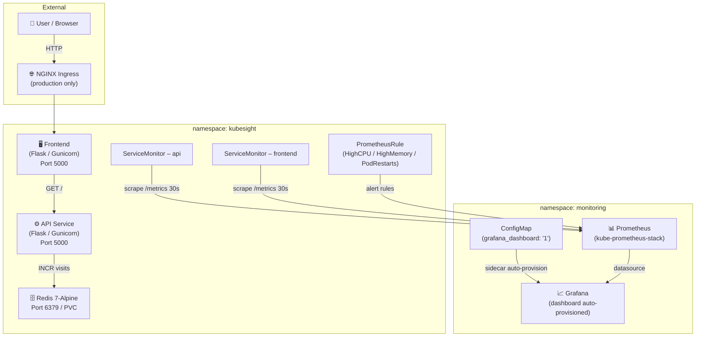

# KubeSight – Production Kubernetes Observability Platform

> A production-grade Kubernetes observability platform demonstrating Helm packaging, Prometheus metrics, Grafana dashboards, and multi-environment deployments.

[](https://github.com/samkeerthana98/kubesight-production-observability/actions/workflows/helm-lint.yml)
[](./LICENSE)


---

## Overview

KubeSight is a Kubernetes observability platform built from scratch to demonstrate end-to-end DevOps skills. It consists of a Python Flask microservices application (API + Frontend) backed by Redis, packaged as a production Helm chart, and integrated with **kube-prometheus-stack** (Prometheus + Grafana) for real-time observability.

What is implemented:

- **RollingUpdate deployments** with configurable maxSurge/maxUnavailable
- **Pod Disruption Budgets** on API, Frontend, and Redis
- **Horizontal Pod Autoscaler** (CPU-based) for API and Frontend
- **Custom Prometheus metrics** (Counters, Histograms) exposed from both services
- **ServiceMonitor CRDs** for automatic Prometheus scraping
- **PrometheusRule alerts** — HighCPU, HighMemory, PodRestarts (enabled in production)
- **Grafana dashboard auto-provisioning** via ConfigMap + Grafana sidecar
- **NetworkPolicy** — frontend open to all, API only from frontend, Redis only from API (production)
- **Non-root containers** (UID 1000) with `runAsNonRoot: true`
- **JSON-structured logging** with per-request IDs on both services
- **Failure simulation endpoints** on the API for manual alert testing

---

## Architecture



> ServiceMonitors and PrometheusRule are deployed in the `kubesight` namespace as part of the Helm release. The Grafana dashboard ConfigMap is deployed to the `monitoring` namespace for sidecar detection.

---

## Technology Stack

| Category | Technology |
|---|---|
| **Container Runtime** | Docker |
| **Orchestration** | Kubernetes (Kind for local dev) |
| **Package Manager** | Helm 3 |
| **API / Frontend** | Python 3.11, Flask 2.3, Gunicorn |
| **Cache / Storage** | Redis 7 (Alpine), PVC-backed |
| **Metrics** | Prometheus via kube-prometheus-stack, prometheus_client (Python) |
| **Visualization** | Grafana 10 (auto-provisioned) |
| **CI** | GitHub Actions (helm lint + helm template) |
| **Local Dev** | Docker Compose |

---

## Project Structure

```
kubesight-production-observability/
├── .github/workflows/
│   └── helm-lint.yml              # Helm lint + template validation (3 envs)
├── app/
│   ├── api/                       # Flask API: metrics, Redis, health, simulate/*
│   └── frontend/                  # Flask Frontend: calls API, page view metrics
├── kubesight-chart/
│   ├── Chart.yaml
│   ├── values.yaml                # Default values
│   ├── values-dev.yaml            # Dev overrides (1 replica, minimal resources)
│   ├── values-production.yaml     # Production: 3 replicas, HPA, PDB, NetworkPolicy
│   ├── grafana-dashboard.json     # Dashboard JSON (embedded into ConfigMap)
│   └── templates/                 # 20 Helm templates
│       ├── api-deployment.yaml    # Probes, security context, rolling update
│       ├── frontend-deployment.yaml
│       ├── redis-deployment.yaml
│       ├── hpa.yaml               # CPU-based HPA for API + Frontend
│       ├── pdb.yaml               # PDB for API, Frontend, Redis
│       ├── networkpolicy.yaml     # open→frontend, frontend→api, api→redis
│       ├── servicemonitor.yaml    # Prometheus scraping CRDs
│       ├── prometheusrule.yaml    # Alert rules (production)
│       ├── grafana-dashboard-configmap.yaml
│       └── ...services, ingress, rbac, secret, configmap
├── kubernetes/
│   └── kind-cluster-config.yaml  # Single control-plane, port 80/443 mapped
├── docs/                          # Architecture, Deployment, Monitoring, Metrics
├── prompts/                       # AI prompts used during development
├── screenshots/
└── docker-compose.yml
```

---

## Features

### Application

| Feature | Detail |
|---|---|
| API endpoints | `/` (visit counter), `/health`, `/version`, `/metrics` |
| Frontend endpoints | `/` (HTML page), `/health`, `/version`, `/metrics` |
| Simulation endpoints | `/simulate/error`, `/simulate/slow`, `/simulate/cpu`, `/simulate/redis-down` |
| Redis counter | `INCR visits` on every `GET /` |
| JSON logging | Structured JSON logs with per-request IDs on both services |
| Non-root containers | `runAsUser: 1000`, `runAsNonRoot: true` |

### Helm Chart

| Feature | Status |
|---|---|
| 20 templates | ✅ api, frontend, redis (deploy + svc + pvc), ingress, hpa, pdb, networkpolicy, serviceaccount, role, rolebinding, configmap, secret, servicemonitor, prometheusrule, grafana-dashboard-configmap |
| Multi-env values | ✅ default / dev / production |
| RollingUpdate strategy | ✅ configurable maxSurge/maxUnavailable |
| Startup + liveness + readiness probes | ✅ on API and Frontend (hit `/health`) |
| HPA (CPU) | ✅ API + Frontend, enabled in production |
| PDB | ✅ API + Frontend + Redis |
| NetworkPolicy | ✅ enabled in production |
| Topology spread constraints | ✅ configurable via values |
| Helm unit tests | ✅ `kubesight-chart/tests/` + connection test hook |

### Observability

| Feature | Detail |
|---|---|
| ServiceMonitors | API + Frontend, scrape `/metrics` every 30s |
| PrometheusRules | HighCPUUsage, HighMemoryUsage, PodRestarts |
| Grafana dashboard | Auto-provisioned via ConfigMap sidecar, no manual import |
| Dashboard panels | Request rate, latency (p50/p95/p99), Redis ops, error rate, pod resources |

---

## Deployment

### Prerequisites

- Docker Desktop, kubectl, [Helm 3](https://helm.sh/docs/intro/install/), [Kind](https://kind.sigs.k8s.io/)

### Option A – Docker Compose (no Kubernetes)

```bash
git clone https://github.com/samkeerthana98/kubesight-production-observability.git
cd kubesight-production-observability
docker compose up --build
```

| Service | URL |
|---|---|
| Frontend | http://localhost:5001 |
| API | http://localhost:5000 |

### Option B – Kubernetes with Helm

```bash
# 1. Create Kind cluster
kind create cluster --config kubernetes/kind-cluster-config.yaml --name kubesight

# 2. Install kube-prometheus-stack
helm repo add prometheus-community https://prometheus-community.github.io/helm-charts
helm repo update
helm install kube-prometheus-stack prometheus-community/kube-prometheus-stack \
  --namespace monitoring --create-namespace \
  --set grafana.sidecar.dashboards.enabled=true \
  --set grafana.sidecar.dashboards.label=grafana_dashboard

# 3. Deploy KubeSight (dev)
helm install kubesight ./kubesight-chart \
  --namespace kubesight --create-namespace \
  -f ./kubesight-chart/values-dev.yaml

# 4. Verify
kubectl get pods -n kubesight
helm test kubesight -n kubesight

# 5. Access services
kubectl port-forward svc/kubesight-frontend 5001:5000 -n kubesight
kubectl port-forward svc/kube-prometheus-stack-grafana 3000:80 -n monitoring
kubectl port-forward svc/kube-prometheus-stack-prometheus 9090:9090 -n monitoring
```

Grafana: http://localhost:3000 — `admin / prom-operator`

---

## Monitoring

### ServiceMonitors

Both services expose `/metrics` and are scraped automatically every 30s. The `release: kube-prometheus-stack` label on each ServiceMonitor is required for Prometheus discovery.

### PrometheusRule Alerts (production only)

| Alert | Condition | Severity |
|---|---|---|
| `HighCPUUsage` | CPU > 80% of limit for 5m | warning |
| `HighMemoryUsage` | Memory working set > 80% of limit for 5m | warning |
| `PodRestarts` | Restart count increased in last 5m | warning |

### Grafana Dashboard

Auto-provisioned via ConfigMap with label `grafana_dashboard: "1"` in the `monitoring` namespace. Sidecar detects and loads it — no manual import needed.

Panels: HTTP request rate, latency (p50/p95/p99), Redis ops, error rate, pod CPU/memory.

---

## Prometheus Metrics

### API Service

| Metric | Type | Labels |
|---|---|---|
| `api_http_requests_total` | Counter | method, endpoint, http_status |
| `api_http_request_duration_seconds` | Histogram | method, endpoint |
| `redis_operations_total` | Counter | operation, status, key |

### Frontend Service

| Metric | Type | Labels |
|---|---|---|
| `frontend_http_requests_total` | Counter | method, endpoint, http_status |
| `frontend_http_request_duration_seconds` | Histogram | method, endpoint |
| `frontend_page_views_total` | Counter | page, http_status |

---

## Multi-Environment Configuration

| Feature | Dev | Production |
|---|---|---|
| Replicas | 1 | 3 |
| HPA | Disabled | Enabled (3–10, target CPU 70%) |
| PDB | minAvailable: 1 | minAvailable: 2 |
| NetworkPolicy | Disabled | Enabled |
| PrometheusRule | Disabled | Enabled |
| Redis PVC | 1Gi | 10Gi |
| Ingress | Disabled | Enabled (nginx) |
| CPU limit | 500m | 1000m |
| Memory limit | 512Mi | 1Gi |

---

## Screenshots

| Screenshot | File |
|---|---|
| Grafana Dashboard | `screenshots/grafana-dashboard.png` |
| Prometheus Targets | `screenshots/prometheus-targets.png` |
| Prometheus Metrics | `screenshots/prometheus-metrics.png` |
| Helm Deploy + Pods | `screenshots/helm-deploy.png`, `screenshots/pods-running.png` |

---

## Future Improvements

- [ ] Push Docker images to ECR / Docker Hub via GitHub Actions
- [ ] Add OpenTelemetry tracing (Jaeger / Tempo)
- [ ] Configure AlertManager receivers (Slack / PagerDuty)
- [ ] Terraform module for EKS cluster provisioning
- [ ] Implement canary deployments with Argo Rollouts

---

## License

MIT — see [LICENSE](./LICENSE)
