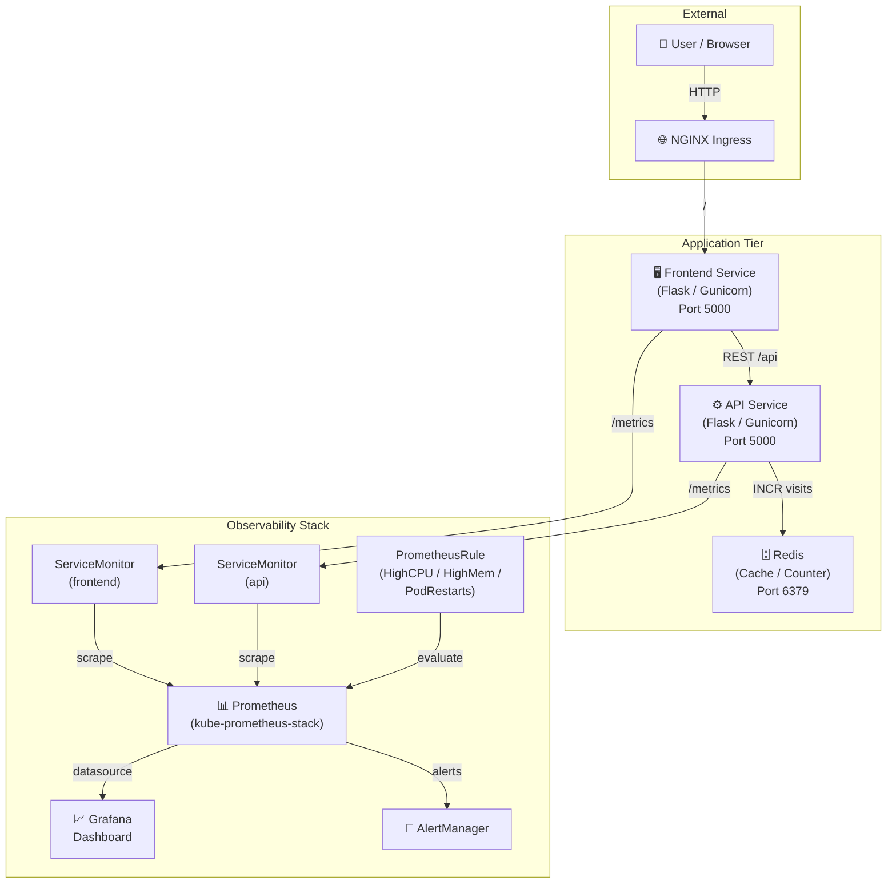
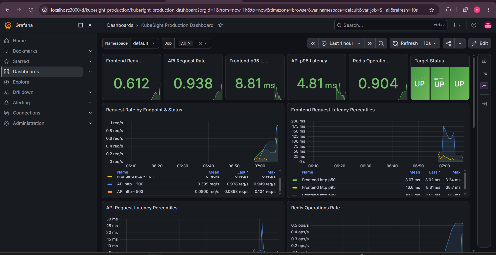
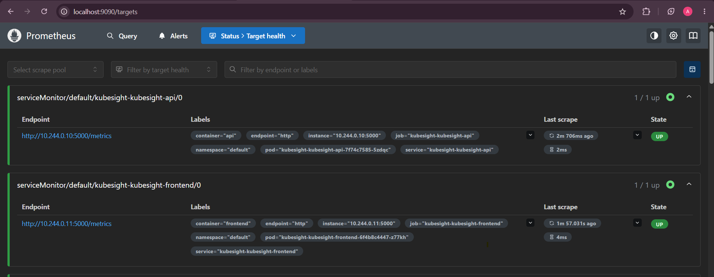
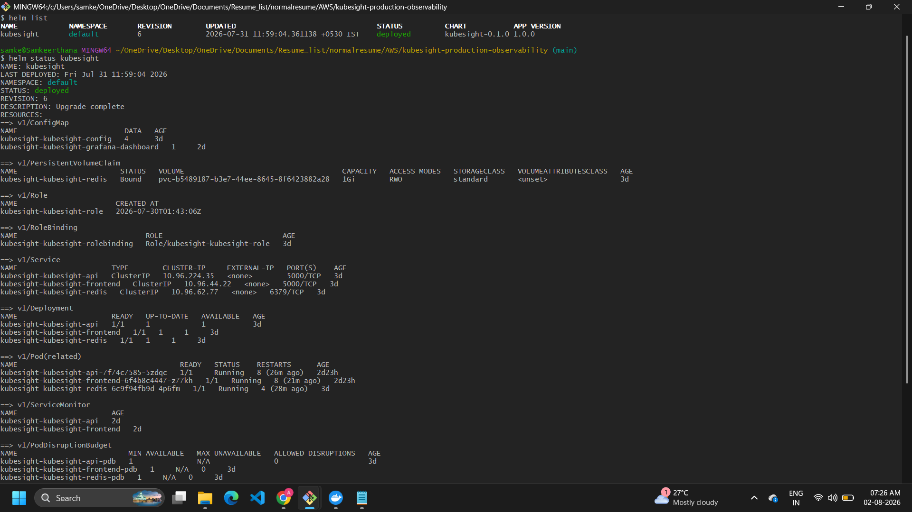
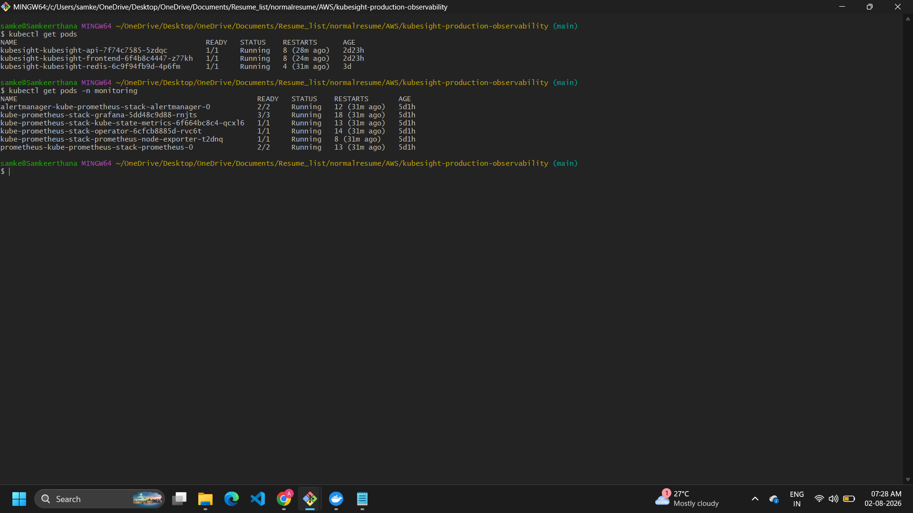

# KubeSight – Production Kubernetes Observability Platform

> A production-grade, cloud-native observability platform built on Kubernetes.  
> Demonstrates real-world DevOps practices: Helm packaging, Prometheus metrics, Grafana dashboards, GitOps-style configuration, and multi-environment deployments.

[](https://github.com/YOUR_USERNAME/kubesight-production-observability/actions/workflows/helm-lint.yml)
[](./LICENSE)


---

## Table of Contents

- [Overview](#overview)
- [Architecture](#architecture)
- [Technology Stack](#technology-stack)
- [Project Structure](#project-structure)
- [Features](#features)
- [Screenshots](#screenshots)
- [Quickstart – Local Development](#quickstart--local-development)
- [Deploying with Helm](#deploying-with-helm)
- [Monitoring](#monitoring)
- [Grafana Dashboard](#grafana-dashboard)
- [Prometheus Metrics](#prometheus-metrics)
- [Multi-Environment Configuration](#multi-environment-configuration)
- [Future Improvements](#future-improvements)
- [Resume Highlights](#resume-highlights)
- [Lessons Learned](#lessons-learned)
- [License](#license)
- [Contributing](#contributing)

---

## Overview

KubeSight is a **production Kubernetes observability platform** built from scratch to demonstrate end-to-end DevOps engineering skills. It consists of a Python Flask microservices application (API + Frontend) backed by Redis, fully packaged as a Helm chart, and integrated with the **kube-prometheus-stack** (Prometheus Operator + Grafana) for real-time observability.

Key production patterns implemented:

- **Zero-downtime deployments** via RollingUpdate strategy
- **High availability** with Pod Disruption Budgets and topology spread constraints
- **Auto-scaling** with Horizontal Pod Autoscaler
- **Structured JSON logging** with request tracing (X-Request-ID)
- **Custom Prometheus metrics** with ServiceMonitor scraping
- **Automated alerting** via PrometheusRules (CPU, memory, pod restarts)
- **Grafana dashboard auto-provisioning** via ConfigMap sidecar
- **Security hardening** with non-root containers, NetworkPolicies, RBAC

---

## Architecture



---

## Technology Stack

| Category | Technology |
|---|---|
| **Container Runtime** | Docker |
| **Orchestration** | Kubernetes (Kind for local, EKS/GKE ready) |
| **Package Manager** | Helm 3 |
| **Backend API** | Python 3.11, Flask 2.3, Gunicorn |
| **Frontend** | Python 3.11, Flask 2.3, Gunicorn |
| **Cache / Storage** | Redis 7 (Alpine) |
| **Metrics Collection** | Prometheus (kube-prometheus-stack) |
| **Visualization** | Grafana 10 |
| **Alerting** | Prometheus Alertmanager |
| **Metrics Library** | prometheus_client (Python) |
| **CI/CD** | GitHub Actions |
| **Cloud Ready** | AWS EKS, GKE, AKS |

---

## Project Structure

```
kubesight-production-observability/
│
├── .github/
│   └── workflows/
│       └── helm-lint.yml          # CI: Helm lint + template validation
│
├── app/
│   ├── api/
│   │   ├── app.py                 # Flask API – metrics, Redis, health endpoints
│   │   ├── Dockerfile             # Multi-stage, non-root container
│   │   ├── requirements.txt
│   │   └── .dockerignore
│   └── frontend/
│       ├── app.py                 # Flask Frontend – calls API, page view metrics
│       ├── Dockerfile
│       ├── requirements.txt
│       └── .dockerignore
│
├── kubesight-chart/               # Production Helm Chart
│   ├── Chart.yaml                 # Chart metadata v0.1.0
│   ├── values.yaml                # Default values (development)
│   ├── values-dev.yaml            # Dev environment overrides
│   ├── values-production.yaml     # Production overrides (HA, autoscaling)
│   ├── grafana-dashboard.json     # Grafana dashboard definition
│   └── templates/
│       ├── _helpers.tpl           # Helm helper templates
│       ├── api-deployment.yaml    # API Deployment with probes & security
│       ├── frontend-deployment.yaml
│       ├── redis-deployment.yaml
│       ├── api-service.yaml
│       ├── frontend-service.yaml
│       ├── redis-service.yaml
│       ├── redis-pvc.yaml         # Persistent Volume Claim for Redis
│       ├── ingress.yaml
│       ├── configmap.yaml
│       ├── secret.yaml
│       ├── serviceaccount.yaml
│       ├── role.yaml              # RBAC Role
│       ├── rolebinding.yaml
│       ├── hpa.yaml               # HorizontalPodAutoscaler
│       ├── pdb.yaml               # PodDisruptionBudget
│       ├── networkpolicy.yaml     # Network isolation
│       ├── servicemonitor.yaml    # Prometheus ServiceMonitors (api + frontend)
│       ├── prometheusrule.yaml    # Alerting rules
│       ├── grafana-dashboard-configmap.yaml  # Grafana sidecar auto-provisioning
│       └── NOTES.txt
│
├── kubernetes/                    # Raw Kubernetes manifests (Kind/local)
│   ├── kind-cluster-config.yaml
│   ├── namespace/
│   ├── deployments/
│   ├── services/
│   └── ingress/
│
├── docs/
│   ├── Architecture.md
│   ├── Deployment.md
│   ├── Monitoring.md
│   ├── Troubleshooting.md
│   ├── Metrics.md
│   └── Dashboard.md
│
├── prompts/                       # AI prompts used during development
├── screenshots/                   # Project screenshots
├── docker-compose.yml             # Local development
├── .gitignore
├── LICENSE
└── README.md
```

---

## Features

### Application
- **REST API** with `/`, `/health`, `/version`, `/metrics` endpoints
- **Redis-backed visit counter** with connection health checks
- **Failure simulation endpoints** (`/simulate/error`, `/simulate/slow`, `/simulate/cpu`, `/simulate/redis-down`) for testing alerting rules
- **Structured JSON logging** with X-Request-ID propagation across services
- **Non-root containers** (UID 1000) for security compliance

### Helm Chart
- **Full production Helm chart** with 20+ templates
- **Multi-environment values** (default / dev / production)
- **HPA** (Horizontal Pod Autoscaler) with CPU-based scaling
- **PDB** (Pod Disruption Budget) for zero-downtime maintenance
- **NetworkPolicy** for strict pod-to-pod communication rules
- **RBAC** with least-privilege Role/RoleBinding/ServiceAccount
- **Topology spread constraints** for zone-aware scheduling
- **Rolling update strategy** with configurable maxSurge/maxUnavailable
- **Startup, liveness, and readiness probes** on all application pods
- **Helm tests** for service connectivity validation

### Observability
- **Custom Prometheus metrics** on both API and Frontend services
- **ServiceMonitors** for automatic Prometheus scraping via kube-prometheus-stack
- **PrometheusRules** with three alert rules: HighCPU, HighMemory, PodRestarts
- **Grafana dashboard auto-provisioning** via ConfigMap and Grafana sidecar
- **Persistent Redis** with configurable PVC size per environment

---

## Screenshots

> See [`screenshots/`](./screenshots/) for a full list of required screenshots.

| Screenshot | Description |
|---|---|
|  | Grafana production dashboard |
|  | Prometheus scrape targets |
|  | Helm deployment output |
|  | All pods in Running state |

---

## Quickstart – Local Development

### Prerequisites

- [Docker Desktop](https://www.docker.com/products/docker-desktop/)
- [kubectl](https://kubernetes.io/docs/tasks/tools/)
- [Helm 3](https://helm.sh/docs/intro/install/)
- [Kind](https://kind.sigs.k8s.io/docs/user/quick-start/) (for local Kubernetes)

### Run with Docker Compose

```bash
git clone https://github.com/YOUR_USERNAME/kubesight-production-observability.git
cd kubesight-production-observability

docker compose up --build
```

Services will be available at:
- **Frontend**: http://localhost:5001
- **API**: http://localhost:5000
- **Redis**: localhost:6379

---

## Deploying with Helm

### 1. Create a Kind cluster

```bash
kind create cluster --config kubernetes/kind-cluster-config.yaml --name kubesight
```

### 2. Install kube-prometheus-stack (Prometheus + Grafana)

```bash
helm repo add prometheus-community https://prometheus-community.github.io/helm-charts
helm repo update

helm install kube-prometheus-stack prometheus-community/kube-prometheus-stack \
  --namespace monitoring \
  --create-namespace \
  --set grafana.sidecar.dashboards.enabled=true \
  --set grafana.sidecar.dashboards.label=grafana_dashboard
```

### 3. Deploy KubeSight

```bash
# Development
helm install kubesight ./kubesight-chart \
  --namespace kubesight \
  --create-namespace \
  -f ./kubesight-chart/values-dev.yaml

# Production
helm install kubesight ./kubesight-chart \
  --namespace kubesight \
  --create-namespace \
  -f ./kubesight-chart/values-production.yaml
```

### 4. Verify the deployment

```bash
kubectl get pods -n kubesight
kubectl get servicemonitors -n kubesight
helm test kubesight -n kubesight
```

### 5. Access services via port-forward

```bash
# Frontend
kubectl port-forward svc/kubesight-frontend 5001:5000 -n kubesight

# Grafana
kubectl port-forward svc/kube-prometheus-stack-grafana 3000:80 -n monitoring

# Prometheus
kubectl port-forward svc/kube-prometheus-stack-prometheus 9090:9090 -n monitoring
```

### Upgrade and Rollback

```bash
# Upgrade
helm upgrade kubesight ./kubesight-chart -n kubesight -f ./kubesight-chart/values-production.yaml

# Rollback
helm rollback kubesight -n kubesight
```

---

## Monitoring

KubeSight integrates with **kube-prometheus-stack** (Prometheus Operator) for full observability.

### ServiceMonitors

Two `ServiceMonitor` CRDs are deployed to tell Prometheus how to scrape each service:

- `kubesight-api` – scrapes `GET /metrics` on port `http` every 30s
- `kubesight-frontend` – scrapes `GET /metrics` on port `http` every 30s

### PrometheusRules (Alerts)

| Alert | Expression | Threshold | Severity |
|---|---|---|---|
| HighCPUUsage | `container_cpu_user_seconds_total` rate | > 80% for 5m | warning |
| HighMemoryUsage | `container_memory_working_set_bytes` | > 80% for 5m | warning |
| PodRestarts | `kube_pod_container_status_restarts_total` | > 0 in 5m | warning |

Enable alerts in production:

```yaml
# values-production.yaml
monitoring:
  prometheusRule:
    enabled: true
```

---

## Grafana Dashboard

The Grafana dashboard is **auto-provisioned** via a Kubernetes ConfigMap and the Grafana sidecar container. No manual import is required.

The dashboard includes:

- HTTP request rate per service
- Request latency (p50, p95, p99)
- Redis operations total
- Error rate
- Pod CPU and memory usage
- Active pod count

**Accessing Grafana:**

```bash
kubectl port-forward svc/kube-prometheus-stack-grafana 3000:80 -n monitoring
# Default credentials: admin / prom-operator
```

Open http://localhost:3000 → Dashboards → KubeSight Production Dashboard

---

## Prometheus Metrics

### API Service

| Metric | Type | Labels | Description |
|---|---|---|---|
| `api_http_requests_total` | Counter | method, endpoint, http_status | Total HTTP requests |
| `api_http_request_duration_seconds` | Histogram | method, endpoint | Request latency |
| `redis_operations_total` | Counter | operation, status, key | Redis operations |

### Frontend Service

| Metric | Type | Labels | Description |
|---|---|---|---|
| `frontend_http_requests_total` | Counter | method, endpoint, http_status | Total HTTP requests |
| `frontend_http_request_duration_seconds` | Histogram | method, endpoint | Request latency |
| `frontend_page_views_total` | Counter | page, http_status | Page view tracking |

---

## Multi-Environment Configuration

| Feature | Default (Dev) | Production |
|---|---|---|
| Replicas | 1 | 3 |
| HPA | Disabled | Enabled (3–10 replicas) |
| PDB | minAvailable: 1 | minAvailable: 2 |
| NetworkPolicy | Disabled | Enabled |
| PrometheusRule | Disabled | Enabled |
| Redis PVC size | 1Gi | 10Gi |
| Ingress | Disabled | Enabled (nginx + TLS) |
| CPU limit | 500m | 1000m |
| Memory limit | 512Mi | 1Gi |

---

## Future Improvements

- [ ] Push Docker images to AWS ECR / Docker Hub with GitHub Actions
- [ ] Add Helm chart to GitHub Pages as a Helm repository
- [ ] Add OpenTelemetry tracing (Jaeger / Tempo integration)
- [ ] Implement Redis Sentinel or Redis Cluster for HA
- [ ] Add Slack / PagerDuty integration for AlertManager
- [ ] Terraform module for EKS cluster provisioning
- [ ] Add Vault integration for secret management
- [ ] Implement canary deployments with Argo Rollouts

---

## Resume Highlights

> Use these bullet points directly on your resume or LinkedIn.

- Designed and deployed a **production Kubernetes observability platform** using Helm, Prometheus, and Grafana on a Kind cluster
- Authored a **20+ template Helm chart** with multi-environment values (dev/production), HPA, PDB, NetworkPolicy, RBAC, and topology spread constraints
- Implemented **custom Prometheus metrics** (Counters, Histograms) in Python Flask and configured **ServiceMonitor CRDs** for automatic scraping via kube-prometheus-stack
- Built a **Grafana dashboard** (auto-provisioned via ConfigMap sidecar) showing request rates, latency percentiles, Redis operation health, and pod resource utilization
- Configured **PrometheusRule alerts** for HighCPU, HighMemory, and PodRestarts with severity labeling for AlertManager routing
- Implemented **zero-downtime rolling deployments** with startup/liveness/readiness probes, PodDisruptionBudgets, and configurable surge/unavailable ratios
- Applied **container security hardening**: non-root users (UID 1000), read-only filesystems, NetworkPolicies, and least-privilege RBAC
- Established **CI/CD with GitHub Actions** to run `helm lint` and `helm template` validation on every pull request

---

## Lessons Learned

- **Prometheus Operator label matching**: ServiceMonitor labels must match the Prometheus `serviceMonitorSelector` — the `release: kube-prometheus-stack` label is required for autodiscovery
- **Grafana sidecar provisioning**: The ConfigMap must have the label `grafana_dashboard: "1"` and be in the monitoring namespace for the sidecar to detect it
- **HPA prerequisites**: Metrics Server must be installed for HPA to function; on Kind clusters this requires an extra manifest
- **PDB and rolling updates**: Setting both `minAvailable` and `maxUnavailable` simultaneously can cause scheduling deadlocks — choose one
- **Helm checksum annotations**: Using `sha256sum` of ConfigMap/Secret in pod annotations forces pod restarts on config changes, a subtle but critical production pattern

---

## License

This project is licensed under the MIT License. See [LICENSE](./LICENSE) for details.

---

## Contributing

This is a portfolio project. Issues and suggestions are welcome via GitHub Issues.

1. Fork the repository
2. Create a feature branch (`git checkout -b feature/your-feature`)
3. Commit your changes (`git commit -m 'Add your feature'`)
4. Push to the branch (`git push origin feature/your-feature`)
5. Open a Pull Request

---

<p align="center">
  Built with ❤️ for the DevOps community.
</p>
