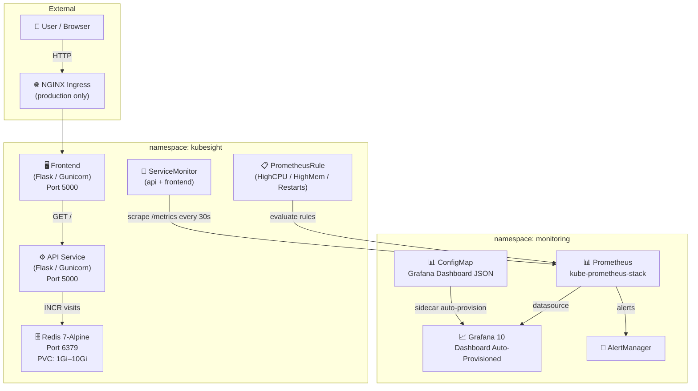

# Architecture

## Overview

KubeSight is a Kubernetes observability platform built with three core services: a Python Flask API, a Python Flask Frontend, and Redis. All three are packaged in a single Helm chart deployed to the `kubesight` namespace.

The platform integrates with **kube-prometheus-stack** (Prometheus Operator + Grafana) installed separately in the `monitoring` namespace.

---

## System Architecture Diagram



> ServiceMonitors and PrometheusRule are deployed in the `kubesight` namespace as part of the Helm release. The Grafana dashboard ConfigMap is deployed to the `monitoring` namespace for sidecar detection.

---

## Component Breakdown

### Frontend Service

- **Language**: Python 3.11, Flask 2.3, Gunicorn
- **Role**: Serves the web UI; calls the API service `GET /` to get the visit count
- **Endpoints**: `/`, `/health`, `/metrics`, `/version`
- **Metrics**: `frontend_http_requests_total`, `frontend_http_request_duration_seconds`, `frontend_page_views_total`
- **Request Tracing**: Propagates `X-Request-ID` header to API on every outgoing call

### API Service

- **Language**: Python 3.11, Flask 2.3, Gunicorn
- **Role**: Business logic, Redis interaction, Prometheus metrics exposure
- **Endpoints**: `/`, `/health`, `/metrics`, `/version`, `/simulate/*`
- **Metrics**: `api_http_requests_total`, `api_http_request_duration_seconds`, `redis_operations_total`
- **Simulation Endpoints**: `/simulate/error`, `/simulate/slow`, `/simulate/cpu`, `/simulate/redis-down`

### Redis

- **Image**: `redis:7-alpine`
- **Role**: Stores the visit counter via `INCR visits`
- **Persistence**: PVC-backed (`ReadWriteOnce`), size configurable per environment
- **Port**: 6379

---

## Request Flow

```
Browser → NGINX Ingress (production only)
       → Frontend Service (Flask)
            → calls API GET /
                → INCR visits on Redis
                → returns JSON {message, visits, redis_status}
            ← returns JSON
       ← renders HTML page with visit count
```

---

## Observability Flow

```
Flask App exposes /metrics (Prometheus text format)
   → ServiceMonitor CRD (in kubesight namespace) tells Prometheus where to scrape
       → Prometheus (in monitoring namespace) scrapes /metrics every 30s
           → Prometheus evaluates PrometheusRules
               → alerts route to AlertManager if thresholds breached
           → Grafana reads Prometheus datasource
               → Dashboard auto-provisioned via ConfigMap sidecar
```

---

## Security

- **Non-root containers**: API and Frontend run as UID 1000; Redis runs as UID 999
- **PodSecurityContext**: `fsGroup: 2000`, `runAsNonRoot: true` on all deployments
- **NetworkPolicy**: Restricts pod-to-pod traffic in production — frontend accepts from anywhere, API only from frontend, Redis only from API
- **Secrets**: `JWT_SECRET` and `REDIS_PASSWORD` stored in a Kubernetes Secret, injected via `envFrom`
- **RBAC**: ServiceAccount, Role, and RoleBinding are created (`rules: []` — no cluster permissions needed by the application)

---

## Production Configuration

| Mechanism | Configuration |
|---|---|
| Replicas | 3 (API + Frontend) |
| HPA | Min 3 / Max 10, target CPU 70% |
| PDB | `minAvailable: 2` |
| Topology Spread | Configurable via values (`topology.kubernetes.io/zone`, `ScheduleAnyway`) |
| Rolling Update | `maxUnavailable: 25%`, `maxSurge: 25%` |
| Probes | Startup + Liveness + Readiness on API and Frontend |

---

## Namespace Layout

| Namespace | Contents |
|---|---|
| `kubesight` | API, Frontend, Redis, HPA, PDB, NetworkPolicy, RBAC, ServiceMonitors, PrometheusRule |
| `monitoring` | kube-prometheus-stack (Prometheus, Grafana, AlertManager), Grafana Dashboard ConfigMap |
