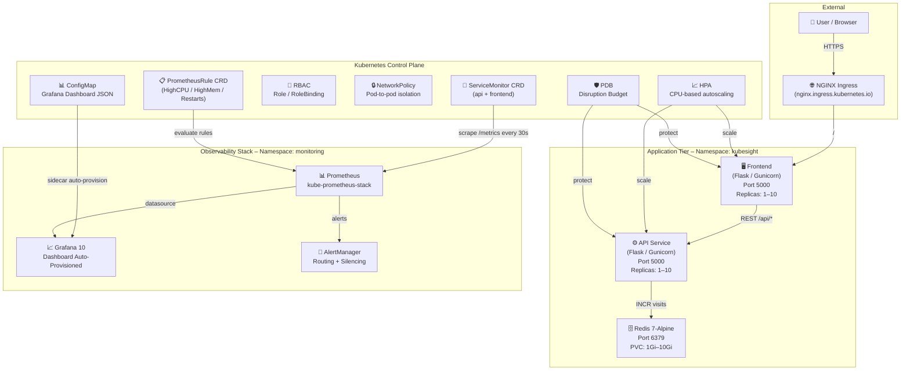

# Architecture

## Overview

KubeSight is a cloud-native observability platform built on Kubernetes. It follows a microservices architecture with three core services: a Python Flask API, a Python Flask Frontend, and Redis for caching and state.

The platform integrates with the **kube-prometheus-stack** (Prometheus Operator + Grafana) for full-stack observability via ServiceMonitors and PrometheusRules.

---

## System Architecture Diagram



---

## Component Breakdown

### Frontend Service

- **Language**: Python 3.11, Flask 2.3, Gunicorn
- **Role**: Serves the web UI, calls the API service for data
- **Endpoints**: `/`, `/health`, `/metrics`, `/version`
- **Metrics**: `frontend_http_requests_total`, `frontend_http_request_duration_seconds`, `frontend_page_views_total`
- **Request Tracing**: Propagates `X-Request-ID` header to API

### API Service

- **Language**: Python 3.11, Flask 2.3, Gunicorn
- **Role**: Business logic, Redis interaction, Prometheus metrics exposure
- **Endpoints**: `/`, `/health`, `/metrics`, `/version`, `/simulate/*`
- **Metrics**: `api_http_requests_total`, `api_http_request_duration_seconds`, `redis_operations_total`
- **Simulation Endpoints**: `/simulate/error`, `/simulate/slow`, `/simulate/cpu`, `/simulate/redis-down`

### Redis

- **Image**: `redis:7-alpine`
- **Role**: In-memory counter and cache
- **Persistence**: PVC-backed (configurable size per environment)
- **Port**: 6379

---

## Request Flow

```
Browser → NGINX Ingress
       → Frontend Service (Flask)
            → renders HTML with data from API
            → calls API Service
                → increments Redis visit counter
                → returns JSON response
            ← returns JSON
       ← returns HTML page
```

---

## Observability Flow

```
Flask App exposes /metrics (Prometheus text format)
   → ServiceMonitor CRD tells Prometheus where to scrape
       → Prometheus scrapes /metrics every 30s
           → Prometheus evaluates PrometheusRules
               → alerts fire to AlertManager if thresholds breached
           → Grafana reads Prometheus datasource
               → Dashboard auto-provisioned via ConfigMap + sidecar
```

---

## Security Architecture

- **Non-root containers**: All pods run as UID 1000
- **RBAC**: Least-privilege Role with get/watch/list on pods and services only
- **NetworkPolicy**: Restricts pod-to-pod communication (production only)
- **Secrets**: JWT_SECRET and REDIS_PASSWORD stored in Kubernetes Secret
- **PodSecurityContext**: `fsGroup: 2000`, `runAsNonRoot: true`

---

## High Availability (Production)

| Mechanism | Configuration |
|---|---|
| Replicas | 3 (API + Frontend) |
| HPA | Min 3 / Max 10, target CPU 70% |
| PDB | `minAvailable: 2` |
| Topology Spread | Zone-aware scheduling across AZs |
| Rolling Update | `maxUnavailable: 25%`, `maxSurge: 25%` |
| Probes | Startup + Liveness + Readiness on all pods |

---

## Namespace Layout

| Namespace | Contents |
|---|---|
| `kubesight` | API, Frontend, Redis, HPA, PDB, NetworkPolicy, RBAC, ServiceMonitors, PrometheusRule |
| `monitoring` | kube-prometheus-stack (Prometheus, Grafana, AlertManager), Grafana Dashboard ConfigMap |
